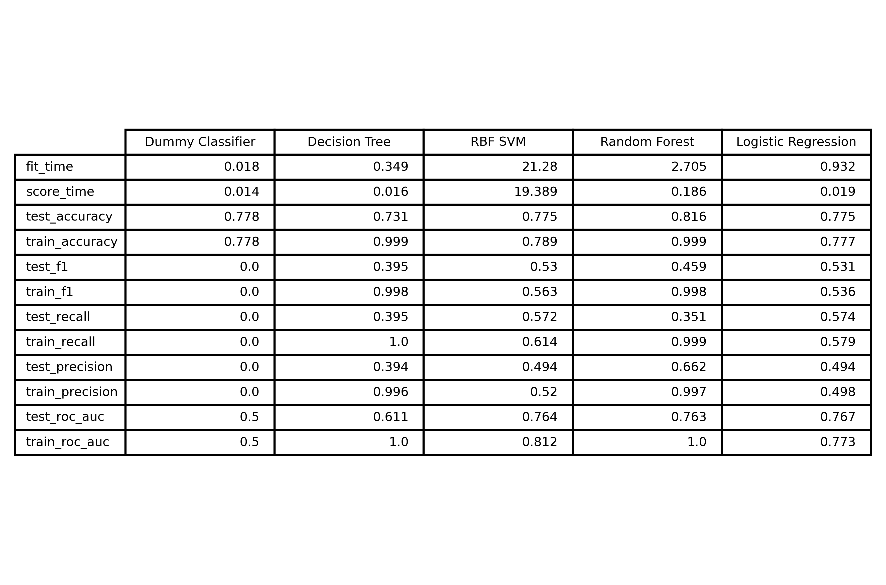

# Methods
## Splitting and cleaning the model
We split our data into train and test data frames with the default setting of 0.2 split ratio. We then converted the categorical features to contain more meaningful strings as their values and the outcome file is saved in the data folder as train_visual.csv file.

## Preprocessing
Since our data was relatively clean, we applied Standard Scaling on the numeric features and One Hot Encoding on the categorical features.

## Choosing the best model
We trained and cross-validated the training dataset on Decision Tree, SVC, Random Forest and Logistic Regression. We also utilized class_weight parameter and set it as ‘balanced’ to deal with the class imbalance that was observed during the initial EDA.
According to our model training, Logistic Regression gave the best validation scores using ROC_AUC as the scoring method.

## Hypertuning the model
On our selected model, we tuned the parameters class_weight and C of the Logistic Regression. We obtained our best parameters and the best model which is saved as the pickle file.

**C: float, default=1.0**  
Inverse of regularization strength; must be a positive float.

**class_weight: dict or ‘balanced’, default=None**  
Weights associated with classes in the form {class_label: weight}.